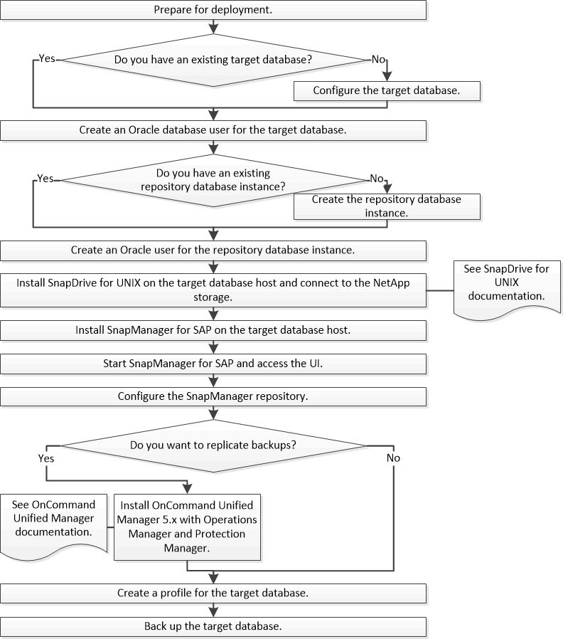

= Fluxo de trabalho de implantação
:allow-uri-read: 
:icons: font
:imagesdir: ../media/

[role="lead"]
Antes de criar backups com o SnapManager, você precisa primeiro instalar o SnapDrive para UNIX e, em seguida, instalar o SnapManager para SAP.

